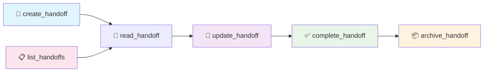
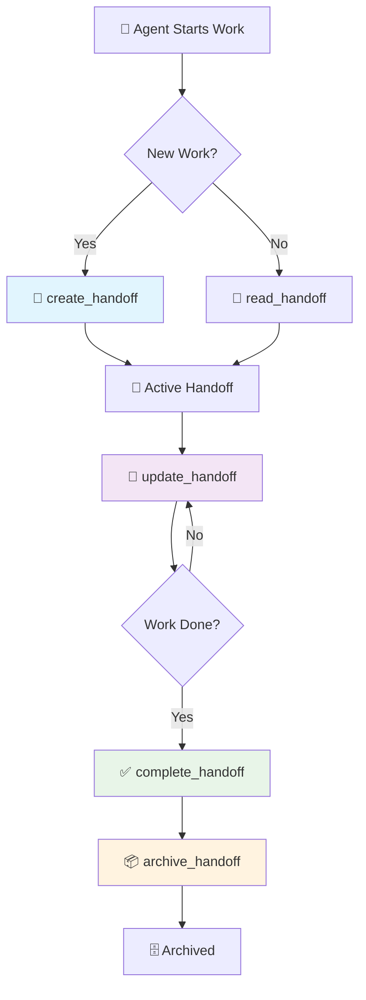

# 🤝 MCP Handoff Server

A **Model Context Protocol (MCP) server** that helps AI agents hand off work to each other with structured documentation and progress tracking.

## ✨ What it does

When AI agents need to pass work between each other, this server provides:
- **📝 Structured handoff documents** with templates
- **🔄 Progress tracking** from start to completion
- **📁 Automatic organization** of active and archived handoffs
- **🔍 Easy searching** and filtering of past work

## 🚀 Quick Start

**Just run it with npx - no installation needed:**

```bash
# Start in MCP mode (for MCP clients)
npx mcp-handoff-server

# Start HTTP server (for testing/direct API access)
npx mcp-handoff-server --mode http
```

That's it! The server automatically creates all needed folders and templates.

## 📋 Basic Usage

### For MCP Clients
Add to your MCP client configuration:
```json
{
  "mcpServers": {
    "handoff-server": {
      "command": "npx",
      "args": ["mcp-handoff-server"]
    }
  }
}
```

### For HTTP Testing
```bash
# Start server
npx mcp-handoff-server --mode http

# Test it works
curl http://localhost:3001/health
```

## 🛠️ Available Tools

The server provides these MCP tools for AI agents:



**Tool Functions:**
- **`create_handoff`** - Start a new handoff document
- **`read_handoff`** - Read an existing handoff
- **`update_handoff`** - Add progress updates
- **`complete_handoff`** - Mark work as finished
- **`archive_handoff`** - Move completed work to archive
- **`list_handoffs`** - Find and filter handoffs

## 📖 Example: Creating a Handoff

```bash
# Start the server
npx mcp-handoff-server --mode http

# Create a new handoff
curl -X POST http://localhost:3001/mcp \
  -H "Content-Type: application/json" \
  -d '{
    "jsonrpc": "2.0",
    "id": 1,
    "method": "create_handoff",
    "params": {
      "type": "quick",
      "initialData": {
        "date": "2025-06-30",
        "time": "14:30 UTC",
        "currentState": {
          "workingOn": "Building user login",
          "status": "50% complete",
          "nextStep": "Add password validation"
        },
        "environmentStatus": {
          "details": {
            "Server": "✅",
            "Database": "✅"
          }
        }
      }
    }
  }'
```

## 🔧 Command Options

```bash
npx mcp-handoff-server [options]

Options:
  --mode <mode>        'mcp' or 'http' (default: mcp)
  --port <port>        HTTP port (default: 3001)
  --handoff-root <dir> Storage directory (default: ./handoff-system)
  --help              Show help
  --version           Show version
```

## 🔄 How It Works

### Simple Workflow
1. **Create** a handoff when starting work
2. **Update** progress as you work
3. **Complete** when finished
4. **Archive** for future reference



### File Organization
The server automatically organizes everything in folders:
- `handoff-system/active/` - Current work
- `handoff-system/archive/` - Completed work
- `handoff-system/templates/` - Document templates

## 🎯 Two Types of Handoffs

**📋 Standard Handoff** - For complex work with detailed context
**⚡ Quick Handoff** - For simple updates and brief transitions

## 🏷️ Status Indicators

- ✅ **Working** - Everything good
- ⚠️ **Warning** - Some issues but not blocked
- ❌ **Error** - Problems that need fixing

## 🛠️ Development

Want to contribute or run locally?

```bash
# Clone and install
git clone <repository-url>
cd mcp-handoff-server
npm install

# Run in development
npm run dev

# Build for production
npm run build
```

## 📄 License

MIT License - feel free to use this in your projects!

## 🆘 Need Help?

- **Issues:** [GitHub Issues](https://github.com/your-repo/mcp-handoff-server/issues)
- **MCP Protocol:** [Model Context Protocol Docs](https://modelcontextprotocol.io/)

---

**Built for seamless AI agent collaboration** 🤖✨
