# 🤝 MCP Handoff Server

A comprehensive **Model Context Protocol (MCP) server** designed to manage AI agent handoffs with structured documentation, progress tracking, and seamless task transitions between agents.

## 🌟 Features

- **📝 Structured Handoff Documents** - Template-based handoff creation with standardized formats
- **🔄 Lifecycle Management** - Complete handoff workflow from creation to archival
- **🏷️ Metadata & Tagging** - Rich metadata support for organization and filtering
- **🔍 Advanced Filtering** - Search by date range, tags, status, and issues
- **📊 Priority System** - Visual priority indicators with emoji-based classification
- **🌍 Environment Tracking** - Real-time status monitoring of system components
- **🚀 Dual Operation Modes** - HTTP server and MCP stdin/stdout protocols
- **📁 Auto-Initialization** - Automatic directory and template creation on startup

## 🚀 Quick Start

### Prerequisites

- **Node.js** 18+
- **npm** or **yarn**

### Installation

```bash
# Clone the repository
git clone <repository-url>
cd mcp-handoff-server

# Install dependencies
npm install

# Start the server
npm run dev
```

The server will automatically create the required directory structure and templates on first startup.

## 🛠️ Usage Modes

### MCP Protocol Mode (Default)
```bash
npm run dev
# Server communicates via stdin/stdout for MCP clients
```

### HTTP Server Mode
```bash
HTTP_MODE=true npm run dev
# Server runs on http://localhost:3001
```

## 📋 Available Tools

### 📖 `read_handoff`
Read a handoff document with optional formatting.

**Parameters:**
```typescript
{
  handoff_id: string;           // ID of the handoff to read
  format?: "full" | "summary";  // Output format (default: "full")
}
```

**Example:**
```json
{
  "method": "read_handoff",
  "params": {
    "handoff_id": "2025-06-30-abc12",
    "format": "summary"
  }
}
```

### ✨ `create_handoff`
Create a new handoff document from template.

**Parameters:**
```typescript
{
  type: "standard" | "quick";
  initialData: {
    date: string;
    time: string;
    currentState: {
      workingOn: string;
      status: string;
      nextStep: string;
    };
    projectContext?: string;
    environmentStatus: {
      details: Record<string, "✅" | "⚠️" | "❌">;
    };
  };
}
```

**Example:**
```json
{
  "method": "create_handoff",
  "params": {
    "type": "standard",
    "initialData": {
      "date": "2025-06-30",
      "time": "14:30 UTC",
      "currentState": {
        "workingOn": "Implementing user authentication",
        "status": "70% complete - working on JWT validation",
        "nextStep": "Add refresh token functionality"
      },
      "projectContext": "Building secure login system for web app",
      "environmentStatus": {
        "details": {
          "Server": "✅",
          "Database": "✅",
          "Redis": "⚠️"
        }
      }
    }
  }
}
```

### 🔄 `update_handoff`
Update specific sections of a handoff document.

**Parameters:**
```typescript
{
  handoff_id: string;
  updates: Array<{
    section: "progress" | "priorities" | "issues" | "environment" | "context";
    content: Record<string, any>;
  }>;
}
```

**Example:**
```json
{
  "method": "update_handoff",
  "params": {
    "handoff_id": "2025-06-30-abc12",
    "updates": [
      {
        "section": "progress",
        "content": {
          "completedItems": [
            "JWT token generation implemented",
            "User login endpoint created"
          ]
        }
      },
      {
        "section": "issues",
        "content": {
          "critical": ["Redis connection intermittent"],
          "nonCritical": ["Need to optimize database queries"]
        }
      }
    ]
  }
}
```

### ✅ `complete_handoff`
Mark a handoff as complete with optional archiving.

**Parameters:**
```typescript
{
  handoff_id: string;
  completionData: {
    endTime: string;
    progress: string[];
    nextSteps: string[];
    archiveReason?: string;
  };
}
```

**Example:**
```json
{
  "method": "complete_handoff",
  "params": {
    "handoff_id": "2025-06-30-abc12",
    "completionData": {
      "endTime": "2025-06-30T16:45:00Z",
      "progress": [
        "Authentication system fully implemented",
        "All tests passing",
        "Documentation updated"
      ],
      "nextSteps": [
        "Deploy to staging environment",
        "Conduct security review"
      ],
      "archiveReason": "Feature complete and tested"
    }
  }
}
```

### 📦 `archive_handoff`
Move a handoff to archive with metadata.

**Parameters:**
```typescript
{
  handoff_id: string;
  metadata: {
    reason: string;
    tags: string[];
    completionStatus: "success" | "partial" | "blocked";
  };
}
```

**Example:**
```json
{
  "method": "archive_handoff",
  "params": {
    "handoff_id": "2025-06-30-abc12",
    "metadata": {
      "reason": "Project milestone completed",
      "tags": ["authentication", "security", "milestone"],
      "completionStatus": "success"
    }
  }
}
```

### 📋 `list_handoffs`
List and filter handoffs by various criteria.

**Parameters:**
```typescript
{
  status: "active" | "archived" | "all";
  type?: "standard" | "quick";
  filters?: {
    dateRange?: { start: string; end: string; };
    tags?: string[];
    hasIssues?: boolean;
  };
}
```

**Example:**
```json
{
  "method": "list_handoffs",
  "params": {
    "status": "active",
    "type": "standard",
    "filters": {
      "dateRange": {
        "start": "2025-06-01",
        "end": "2025-06-30"
      },
      "hasIssues": true
    }
  }
}
```

## 🔄 Handoff Workflow

The MCP Handoff Server follows a structured workflow for managing AI agent transitions:

### Main Workflow Diagram

```mermaid
graph TD
    A[Agent Starts Work] --> B{Need New Handoff?}
    B -->|Yes| C[create_handoff]
    B -->|No| D[read_handoff]

    C --> E[Handoff Created<br/>📝 Active Status]
    D --> F[Review Existing Handoff]

    E --> G[Work in Progress]
    F --> G

    G --> H[update_handoff<br/>📊 Progress Updates]
    H --> I{Work Complete?}

    I -->|No| G
    I -->|Yes| J[complete_handoff<br/>✅ Mark Complete]

    J --> K{Archive Needed?}
    K -->|Yes| L[archive_handoff<br/>📦 Move to Archive]
    K -->|No| M[Keep in Active]

    L --> N[Archived Handoff<br/>🗄️ With Metadata]
    M --> O[Active Complete Handoff]

    P[list_handoffs<br/>🔍 Search & Filter] --> Q[View All Handoffs]

    style C fill:#e1f5fe
    style H fill:#f3e5f5
    style J fill:#e8f5e8
    style L fill:#fff3e0
    style P fill:#fce4ec
```



### Document Lifecycle


## 📁 Directory Structure

The server automatically creates and manages the following structure:

```
handoff-system/
├── active/              # Currently active handoff documents
├── archive/             # Completed and archived handoffs
└── templates/           # Document templates
    ├── handoff-template.md    # Standard detailed handoff
    └── quick-handoff.md       # Quick transition handoff
```

> **Note:** The entire `handoff-system/` directory is automatically created on server startup, so it's excluded from version control.

## 🎯 Handoff Types

### 📋 Standard Handoff
- **Use Case:** Major transitions, complex work handoffs
- **Features:** Detailed project context, comprehensive progress tracking
- **Template:** `handoff-template.md`
- **Sections:** Project context, recent progress, active work, environment status, known issues

### ⚡ Quick Handoff
- **Use Case:** Brief transitions, simple status updates
- **Features:** Streamlined format for rapid handoffs
- **Template:** `quick-handoff.md`
- **Sections:** Current state, recent completions, immediate priorities, environment status

## 🏷️ Priority & Status Indicators

### Priority Levels
- 🔥 **Critical Priority** (4) - Urgent, blocking issues
- ⚡ **High Priority** (3) - Important, time-sensitive
- 📋 **Medium Priority** (2) - Standard workflow items
- 💡 **Low Priority** (1) - Nice-to-have, future considerations

### Environment Status
- ✅ **Operational** - System running normally
- ⚠️ **Warning** - Issues present but not blocking
- ❌ **Error** - Critical problems, system blocked

## 💡 Usage Examples

### Complete Workflow Example

```bash
# 1. Create a new handoff
curl -X POST http://localhost:3001/mcp \
  -H "Content-Type: application/json" \
  -d '{
    "jsonrpc": "2.0",
    "id": 1,
    "method": "create_handoff",
    "params": {
      "type": "standard",
      "initialData": {
        "date": "2025-06-30",
        "time": "14:30 UTC",
        "currentState": {
          "workingOn": "User authentication system",
          "status": "JWT implementation in progress",
          "nextStep": "Add refresh token functionality"
        },
        "environmentStatus": {
          "details": {
            "Server": "✅",
            "Database": "✅",
            "Redis": "⚠️"
          }
        }
      }
    }
  }'

# 2. Update progress
curl -X POST http://localhost:3001/mcp \
  -H "Content-Type: application/json" \
  -d '{
    "jsonrpc": "2.0",
    "id": 2,
    "method": "update_handoff",
    "params": {
      "handoff_id": "2025-06-30-abc12",
      "updates": [
        {
          "section": "progress",
          "content": {
            "completedItems": [
              "JWT token generation implemented",
              "Login endpoint created and tested"
            ]
          }
        }
      ]
    }
  }'

# 3. Complete and archive
curl -X POST http://localhost:3001/mcp \
  -H "Content-Type: application/json" \
  -d '{
    "jsonrpc": "2.0",
    "id": 3,
    "method": "complete_handoff",
    "params": {
      "handoff_id": "2025-06-30-abc12",
      "completionData": {
        "endTime": "2025-06-30T18:00:00Z",
        "progress": [
          "Authentication system fully implemented",
          "All unit tests passing",
          "Documentation updated"
        ],
        "nextSteps": [
          "Deploy to staging environment",
          "Conduct security audit"
        ],
        "archiveReason": "Feature complete and ready for deployment"
      }
    }
  }'
```

## ⚙️ Configuration

### Environment Variables

| Variable | Default | Description |
|----------|---------|-------------|
| `PORT` | `3001` | HTTP server port (when `HTTP_MODE=true`) |
| `HANDOFF_ROOT` | `./handoff-system` | Path to handoff system directory |
| `HTTP_MODE` | `false` | Enable HTTP server mode instead of MCP stdin/stdout |

### Example Configuration

```bash
# .env file
PORT=3001
HANDOFF_ROOT=/path/to/handoff-system
HTTP_MODE=true
```

## 🛠️ Development

### Scripts

```bash
# Development with hot reload
npm run dev

# Build TypeScript to JavaScript
npm run build

# Start production server
npm start

# Run with custom environment
HTTP_MODE=true PORT=3002 npm run dev
```

### Project Structure

```
mcp-handoff-server/
├── src/
│   └── index.ts              # Main server implementation
├── handoff-system/           # Auto-generated on startup
│   ├── active/              # Active handoffs
│   ├── archive/             # Archived handoffs
│   └── templates/           # Document templates
├── package.json             # Dependencies and scripts
├── tsconfig.json           # TypeScript configuration
├── mcp.json               # MCP tool definitions
└── README.md              # This file
```

### Testing

```bash
# Test the server with the included test script
node test-handoff.js

# Or test manually with curl (HTTP mode)
HTTP_MODE=true npm run dev &
curl -X POST http://localhost:3001/mcp \
  -H "Content-Type: application/json" \
  -d '{"jsonrpc":"2.0","id":1,"method":"list_handoffs","params":{"status":"all"}}'
```

## 🚀 Deployment

### Production Setup

1. **Build the application:**
   ```bash
   npm run build
   ```

2. **Set environment variables:**
   ```bash
   export NODE_ENV=production
   export PORT=3001
   export HANDOFF_ROOT=/var/lib/handoff-system
   ```

3. **Start the server:**
   ```bash
   npm start
   ```

### Docker Deployment

```dockerfile
FROM node:18-alpine

WORKDIR /app
COPY package*.json ./
RUN npm ci --only=production

COPY . .
RUN npm run build

EXPOSE 3001
ENV HTTP_MODE=true
ENV PORT=3001

CMD ["npm", "start"]
```

### MCP Client Integration

To use with MCP clients, configure your client to connect to this server:

```json
{
  "mcpServers": {
    "handoff-server": {
      "command": "node",
      "args": ["dist/index.js"],
      "env": {
        "HANDOFF_ROOT": "./handoff-system"
      }
    }
  }
}
```

## 🔍 API Reference

### JSON-RPC 2.0 Format

All requests follow the JSON-RPC 2.0 specification:

```json
{
  "jsonrpc": "2.0",
  "id": 1,
  "method": "method_name",
  "params": {
    // method-specific parameters
  }
}
```

### Response Format

```json
{
  "jsonrpc": "2.0",
  "id": 1,
  "result": {
    // method-specific result data
  }
}
```

### Error Response

```json
{
  "jsonrpc": "2.0",
  "id": 1,
  "error": {
    "code": -32000,
    "message": "Error description",
    "data": {
      // additional error details
    }
  }
}
```

## 🤝 Contributing

1. **Fork the repository**
2. **Create a feature branch:** `git checkout -b feature/amazing-feature`
3. **Commit changes:** `git commit -m 'Add amazing feature'`
4. **Push to branch:** `git push origin feature/amazing-feature`
5. **Open a Pull Request**

### Development Guidelines

- Follow TypeScript best practices
- Use Zod for input validation
- Add comprehensive error handling
- Update documentation for new features
- Test both HTTP and MCP modes

## 📄 License

This project is licensed under the MIT License - see the [LICENSE](LICENSE) file for details.

## 🆘 Support

- **Issues:** [GitHub Issues](https://github.com/your-repo/mcp-handoff-server/issues)
- **Documentation:** This README and inline code comments
- **MCP Protocol:** [Model Context Protocol Specification](https://modelcontextprotocol.io/)

---

**Built with ❤️ for seamless AI agent collaboration**
